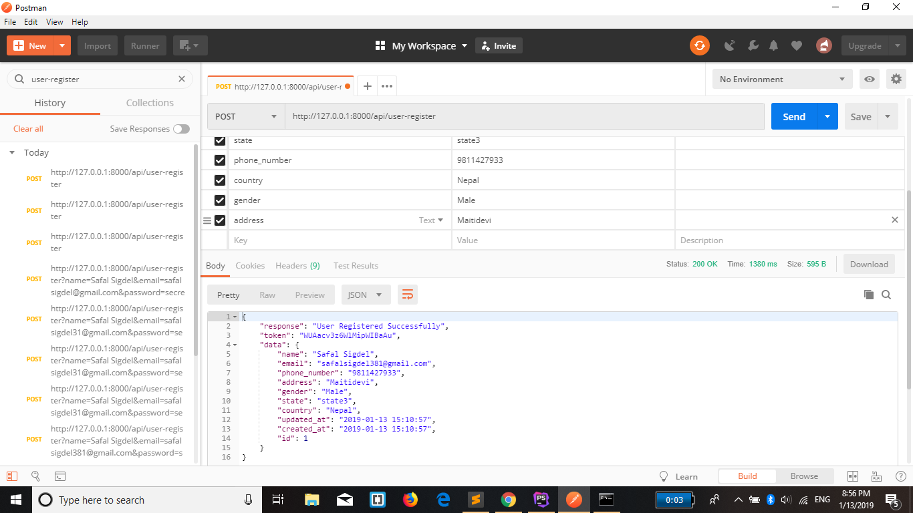
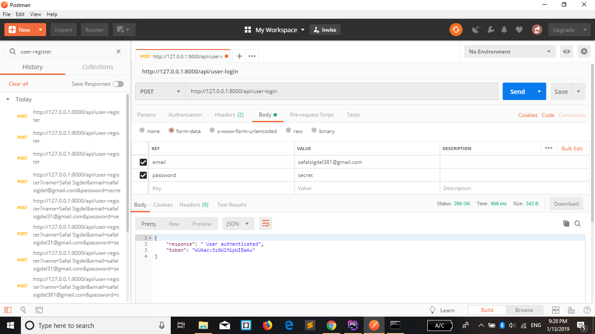
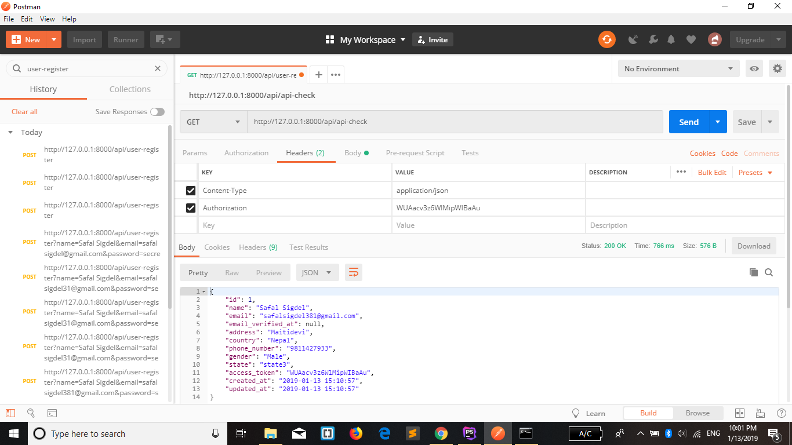

<!DOCTYPE html>
<html>
<body>
<h1>userapi</h1>

A laravel package that demonstrates REST api using custom authentication(without passport).No nedd to install laravel passport.
All the stuff is handled by ApiToken(name any) middleware.

<h3> Instructions</h3>

git clone this repository and cd inside the project root, then enter the following commands:

<ol>
<li>composer install</li>
<li>cp .env.example .env</li>
<li>php artisan key:generate</li>
<li>Now open `.env` file and make necessary changes to the **DB_** section</li>
<li>php artisan migrate</li>
<li>php artisan serve</li>
</ol>

After setup you can call following routes:

 * To register,  Send post request to  api/user-register route using Postman or any other Http client library with following fields:  
 
 i) name  
 ii) email  
 ii) password  
 iii) phone_number  
 iv) address  
 v) gender  
 vi) country  
 vii) state 
 
 

 
 Example
  
  
 
 * To login,  Send post request to  api/user-login route using Postman or any other Http client library with following fields:  
  
  i) email  
  ii) email   
  

  Example 
  
   
  
 1) In api.php define route that is protected by ApiToken middleware.These route can only be accessed when token is present in the request header.

  
 2) Upon registration token is received which can be used to access various part of the application. 

  
 3) To access api routes,Authorization header must be set.  

  
 4) The value of Authorization is the token that is received after registration.
 
  
 5) When the token matches, user can access the resource that is requested.

  
In below example 'api-check' route is accessed which is protected by ApiToken middleware.  
  To access this route Authorization header is set 
  

  
   
  <h4>Build your own api using custom authentication :)</h4>
  
</body>
</html>